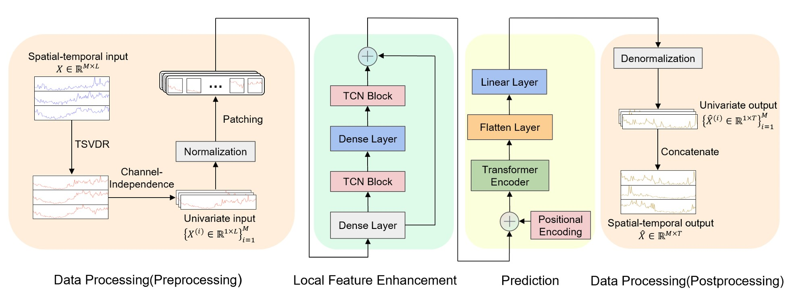
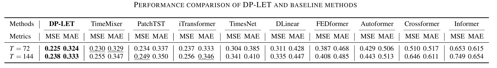
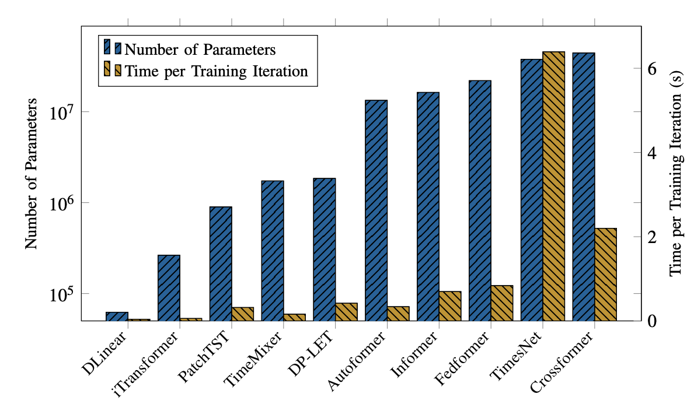

# DP-LET

Official implementation for the paper:  [DP-LET: An Efficient Spatio-Temporal Network Traffic Prediction Framework](https://arxiv.org/abs/2504.03792)

---
## Updates/News:

🚩 News (Aug. 2025): DP-LET has been accepted by IEEE Global Communications Conference 2025 ! 　

---

## Overall Architecture



---

## Usage

#### 1. Create and activate a virtual environment
```bash
conda create -n DP-LET python=3.8
conda activate DP-LET
```
##### 💡Hint:
If you don't have Miniconda or Anaconda installed, please download it from: https://www.anaconda.com/download

#### 2. Install dependencies
```bash
cd framework
pip install -r requirements.txt
```
##### 💡Hint:
We used a Quadro RTX 5000 GPU for training, with CUDA version 11.4.
If you wish to use a different version, please refer to https://pytorch.org/get-started/previous-versions/ to download the appropriate version of PyTorch for your CUDA environment.

#### 3. Prepare the dataset

Download the [Call Detail Records Dataset](https://doi.org/10.7910/DVN/EGZHFV)

You can choose any desired time duration and number of cells, and save the file as:
```
framework/data/MILAN/Milan_Internet_[cell_number]_10min.csv
```
For example:
```
framework/data/MILAN/Milan_Internet_100_10min.csv
```
For reproducibility, we provide the exact subset of cell IDs used in our experiments in `cell_id.txt`. Using these IDs, users can reconstruct the dataset split consistent with our experimental setup.

#### 4. Run the training script
```bash
python run.py
```

---

## Main Result of Spatio-Temporal Network Traffic Prediction



A case study on real-world cellular traffic prediction demonstrates the practicality of DP-LET, which maintains low computational complexity while achieving state-of-the-art performance.
Compared to baseline models, DP-LET significantly reduces MSE by **31.8%** and MAE by **23.1%**, highlighting its superior predictive capability.

<div align="center">
  
</div>


In contrast to other Transformer-based approaches, DP-LET maintains competitive performance even with fewer trainable parameters, showing its efficiency in modeling complex spatio-temporal dependencies with reduced computational burden.

---

## Citation

```bibtex
@INPROCEEDINGS{11432477,
  author={Wang, Xintong and Nan, Haihan and Li, Ruidong and Wu, Huaming},
  booktitle={GLOBECOM 2025 - 2025 IEEE Global Communications Conference}, 
  title={DP-LET : An Efficient Spatio-Temporal Network Traffic Prediction Framework}, 
  year={2025},
  volume={},
  number={},
  pages={5671-5676},
  keywords={Accuracy;Computational modeling;Noise reduction;Telecommunication traffic;Computer architecture;Predictive models;Transformers;Data processing;Feature extraction;Computational complexity;Traffic Prediction;Deep Learning;Transformer;Performance Evaluation},
  doi={10.1109/GLOBECOM59602.2025.11432477}}
```

