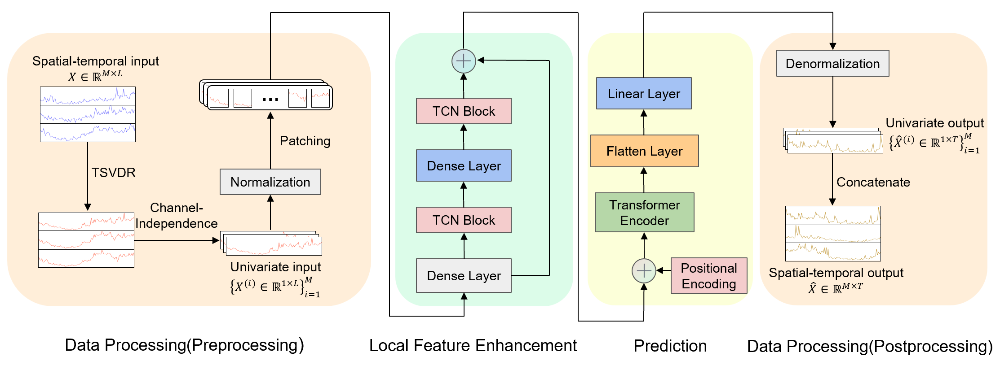
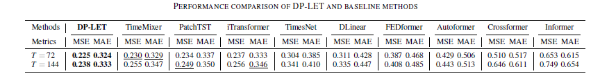

# DP-LET

> **DP-LET: An Efficient Spatio-Temporal Network Traffic Prediction Framework**  

DP-LET is a novel deep learning framework for accurate and efficient **spatio-temporal network traffic prediction**. It combines **denoising-based preprocessing**, **temporal convolution for local patterns**, and **Transformers for global modeling**. Designed for real-world cellular traffic, DP-LET achieves **state-of-the-art performance** while maintaining low computational overhead.

---

## 🚀 Highlights

- 📉 **TSVDR-Based Preprocessing**  
  Removes noise and decouples spatial dependencies with minimal memory usage.

- 🧠 **Local Feature Enhancement**  
  Extracts fine-grained temporal features using multi-branch Temporal Convolutional Networks.

- 🔁 **Transformer Prediction**  
  Captures long-range dependencies with efficient self-attention.

- ⚡ **Lightweight & Accurate**  
  Reduces **MSE by 31.8%** and **MAE by 23.1%** compared to other SOTA models.

---

## 🏗️ Architecture Overview


---

## 📊 Performance



## How to Use

1. Install dependencies:
    ```bash
    pip install -r requirements.txt
    ```
    
2. Download and place the dataset in the following directory:
    ```
    ./data/MILAN
    ```
    > The dataset is the Milan CDR dataset provided by Telecom Italia https://doi.org/10.7910/DVN/EGZHFV

3. Modify the YAML configuration file to set hyperparameters

4. Run the main script to start training or inference:
    ```bash
    python run.py
    ```

---

🧩 Tip: All baseline experiments follow the standardized structure of [Time-Series-Library]([https://github.com/your-org/time-series-lib](https://github.com/thuml/Time-Series-Library.git)) for fair and consistent evaluation.
