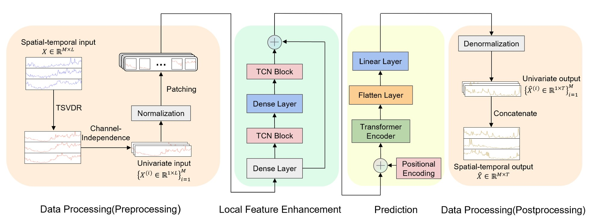

# DP-LET

Official implementation for the paper:  [DP-LET: An Efficient Spatio-Temporal Network Traffic Prediction Framework](https://arxiv.org/abs/2504.03792)

---

## Overall Architecture



---

## Usage

#### 1. Create and activate a virtual environment
```bash
conda create -n DP-LET python=3.8
conda activate DP-LET
```

#### 2. Install dependencies
```bash
cd framework
pip install -r requirements.txt
```

#### 3. Prepare the dataset

Download the [Call Detail Records Dataset](https://doi.org/10.7910/DVN/EGZHFV)

You can choose any desired time duration and number of cells, and save the file as:
```
framework/data/MILAN/Milan_Internet_[cell_number]_10min.csv
```
For example:
```
framework/data/MILAN/Milan_Internet_100_10min.csv
```

#### 4. Run the training script
```bash
python run.py
```

---

## Main Result of Spatio-Temporal Network Traffic Prediction


---

## Citation

```bibtex
@misc{wang2025dpletefficientspatiotemporalnetwork,
      title={DP-LET: An Efficient Spatio-Temporal Network Traffic Prediction Framework}, 
      author={Xintong Wang and Haihan Nan and Ruidong Li and Huaming Wu},
      year={2025},
      eprint={2504.03792},
      archivePrefix={arXiv},
      primaryClass={cs.LG},
      url={https://arxiv.org/abs/2504.03792}, 
}
```

